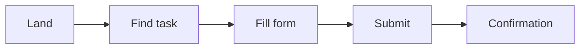

# UI/UX Pro+

## Core Principle

Good UI/UX removes obstacles between the user and their goal. Every decision must answer: *does this help the user complete their task faster, with less friction, and with more confidence?*

## Design System Thinking

### Design Tokens
Define colors, spacing, typography, and shadows as tokens before writing CSS:

```css
:root {
  --color-primary: #C62828;
  --color-primary-hover: #8E1B1B;
  --color-accent: #FFB300;
  --color-bg: #fafafa;
  --color-surface: #ffffff;
  --color-text: #212121;
  --color-text-secondary: #666666;
  --space-xs: 4px; --space-sm: 8px; --space-md: 16px;
  --space-lg: 24px; --space-xl: 32px; --space-2xl: 48px;
  --radius-sm: 6px; --radius-md: 10px; --radius-lg: 16px;
  --shadow-sm: 0 2px 8px rgba(0,0,0,.06);
  --shadow-md: 0 4px 24px rgba(0,0,0,.08);
  --shadow-lg: 0 8px 40px rgba(0,0,0,.12);
  --font-body: 'Inter', system-ui, sans-serif;
  --font-heading: 'Playfair Display', Georgia, serif;
}
```

### Component Variants
Every component needs: default, hover, active, focus, disabled, error states. Never skip focus.

## Visual Hierarchy

### The 60-30-10 Rule
- **60%** neutral/background
- **30%** primary brand
- **10%** accent (CTAs, highlights)

### Typography Scale
Use a modular scale (1.25 or 1.333):

```css
--text-sm: 0.875rem;   /* 14px */
--text-base: 1rem;     /* 16px */
--text-lg: 1.25rem;    /* 20px */
--text-xl: 1.5rem;     /* 24px */
--text-2xl: 2rem;      /* 32px */
--text-3xl: 2.5rem;    /* 40px */
--text-4xl: 3rem;      /* 48px */
```

Max 2 font families. Max 3 weights per family.

### Line Length
Body text: 60-75 characters per line (`max-width: 65ch`). Headings: no limit.

## Accessibility (WCAG 2.1 AA Minimum)

| Requirement | Minimum | How |
|---|---|---|
| Color contrast | 4.5:1 normal, 3:1 large text | Check every pair |
| Focus indicators | 2px outline, 3px offset | Never `outline: none` without replacement |
| Touch targets | 44×44px | Padding, not just clickable area |
| Form labels | Visible labels required | Never only placeholders |
| Error messages | Inline, near field | Never alerts or popups |
| Heading order | h1 → h2 → h3 (no skips) | Sequential hierarchy |
| Alt text | Meaningful descriptions | Decorative images: `alt=""` |
| ARIA | Only when native HTML is insufficient | Use native `<button>`, `<nav>`, `<label>` first |

### Contrast Quick Check
```js
// Relative luminance
function luminance(r, g, b) {
  const [R, G, B] = [r, g, b].map(v => {
    v /= 255;
    return v <= 0.03928 ? v / 12.92 : Math.pow((v + 0.055) / 1.055, 2.4);
  });
  return 0.2126 * R + 0.7152 * G + 0.0722 * B;
}
function contrastRatio(hex1, hex2) { ... }
```

## Task-Oriented Design

### Golden Path
Identify the single most common user goal. Design the flow end-to-end before adding secondary features.

### Task Flow Before Layout


### Progressive Disclosure
Show only what the user needs at each step. Hide advanced options behind an "Advanced" toggle.

## Form Design

| Element | Best Practice |
|---|---|
| Labels | Visible above field, not floating |
| Placeholders | Only as examples, never replace labels |
| Validation | Show inline error on blur or submit |
| Success | Replace form with confirmation message |
| Error color | Red `#EF5350` + icon |
| Success color | Green `#4CAF50` + icon |
| Required markers | Asterisk `*` or "Required" text |
| Field width | Match expected input length |

### Validation UX
1. Validate on blur (not keypress — too aggressive)
2. Show all errors on submit
3. Error message format: "What's wrong + how to fix"
4. Keep submitted data, never clear on error

## Microinteractions

| Element | Duration | Easing |
|---|---|---|
| Hover | 150-200ms | ease-out |
| Focus | 200ms | ease-out |
| Page scroll | 300ms | smooth |
| Modal open | 200ms | ease-out + scale(.95→1) |
| Notification | 300ms | ease-out + slide |
| Loading shimmer | 1s loop | linear |

### Feedback States
Every interactive element needs 5 states:
```css
.btn { }                    /* default */
.btn:hover { }              /* hover */
.btn:active { }             /* press */
.btn:focus-visible { }      /* keyboard focus */
.btn:disabled { }           /* disabled */
```

## Information Architecture

### Card Sorting
Group content by user mental model, not organizational structure.

### Nielsen's 10 Heuristics
1. **Visibility of system status** — show loading, progress, confirmation
2. **Match between system and real world** — use user's language
3. **User control and freedom** — undo, back, cancel
4. **Consistency and standards** — same patterns everywhere
5. **Error prevention** — ask "Are you sure?" before destructive actions
6. **Recognition not recall** — visible options, not remembered commands
7. **Flexibility and efficiency of use** — shortcuts for power users
8. **Aesthetic and minimalist design** — no irrelevant information
9. **Help users recognize, diagnose, and recover from errors** — plain language errors
10. **Help and documentation** — searchable, task-focused help

## Responsive Methodology

Not device-based breakpoints. Content-based breakpoints:

```css
/* Base: mobile first (375px) */
.grid { grid-template-columns: 1fr; }

/* Content tells us when to widen */
@media (min-width: 640px) {
  .grid { grid-template-columns: repeat(2, 1fr); }
}
@media (min-width: 960px) {
  .grid { grid-template-columns: repeat(3, 1fr); }
}
```

### Mobile Non-Negotiables
- Tap targets ≥ 44×44px
- No horizontal scroll
- Bottom navigation for primary actions
- Readable font size (min 16px for inputs to prevent iOS zoom)
- Full-width buttons

## Performance UX

| Technique | Use Case |
|---|---|
| Skeleton screens | Content loading |
| Optimistic UI | Form submissions |
| Lazy loading | Images below fold |
| Preload | Critical hero assets |
| Instant navigation | SPA-like page transitions |

## Design Review Checklist

Before shipping, verify:

- [ ] WCAG 2.1 AA contrast on every text/background pair
- [ ] Keyboard navigable (Tab order, focus indicators visible)
- [ ] Form labels visible (not just placeholders)
- [ ] Touch targets ≥ 44×44px
- [ ] No horizontal scroll at any viewport
- [ ] Loading, empty, error, and success states exist
- [ ] Hover + focus states on all interactive elements
- [ ] Consistent spacing (use spacing scale)
- [ ] Max line length ≤ 75 characters
- [ ] One primary action per page/section
- [ ] Mobile: bottom bar for key actions, hamburger for nav
- [ ] Alt text on all meaningful images

## Common Mistakes

| Mistake | Fix |
|---|---|
| Placeholder as label | Add visible `<label>` |
| Outline: none on focus | Add `:focus-visible` styles |
| Pure black text | Use `#1a1a1a` or `#212121` |
| Too many font sizes | Use defined scale |
| Skipping error states | Design empty, error, loading variants |
| Desktop-first CSS | Write mobile-first media queries |
| No feedback on submit | Show spinner or optimistic UI |
